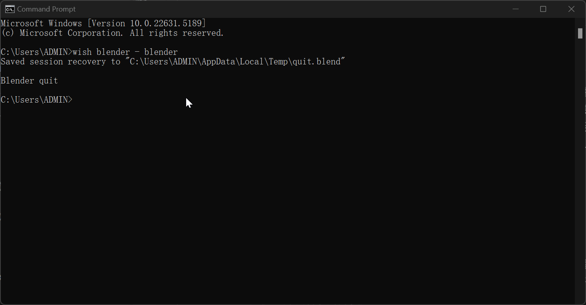
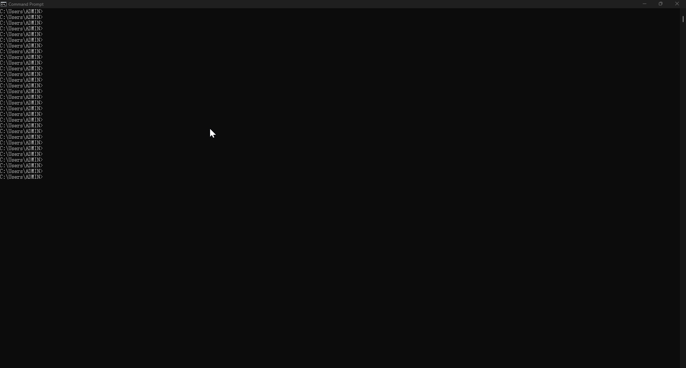
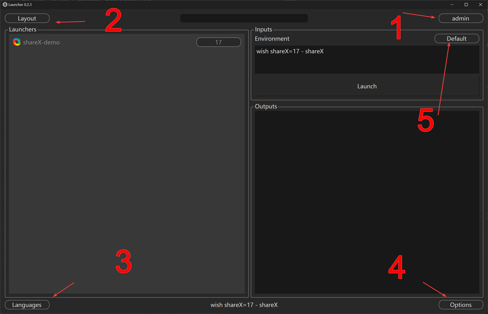
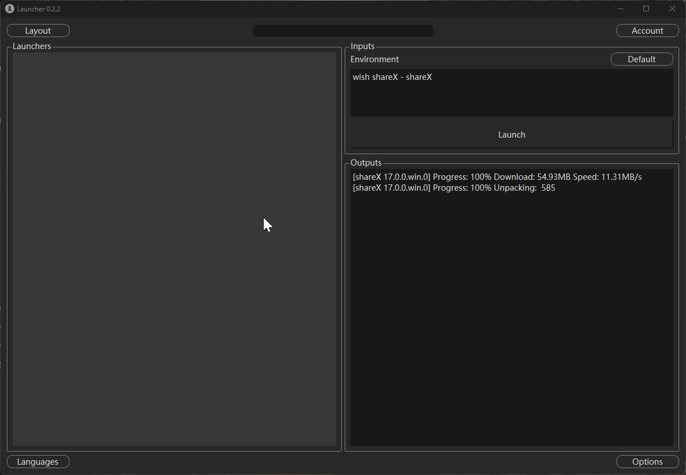
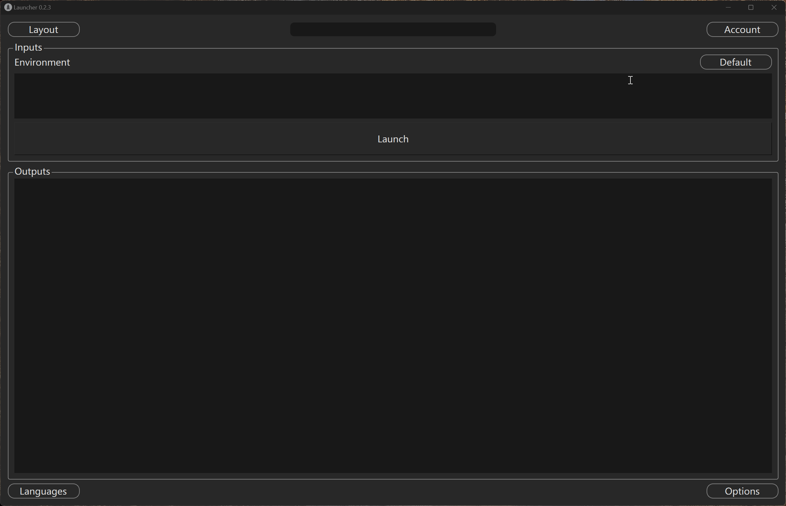
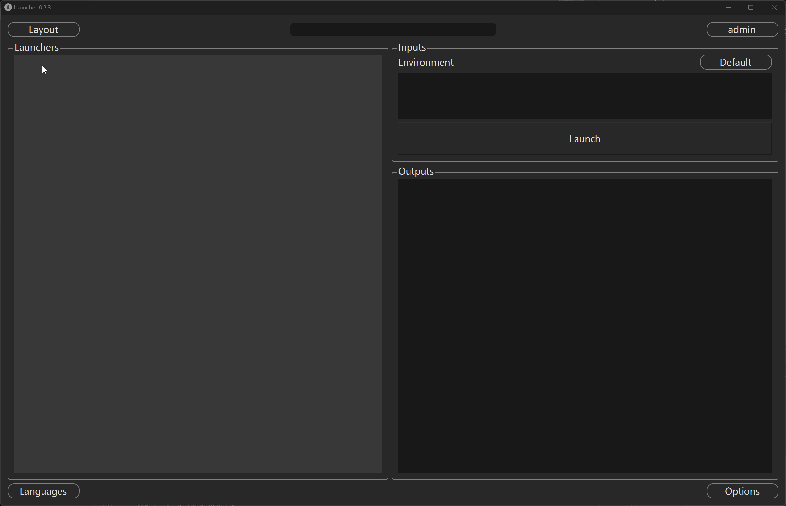
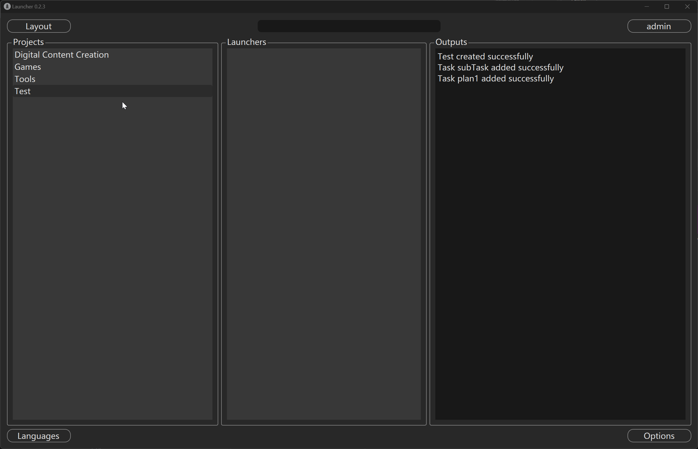
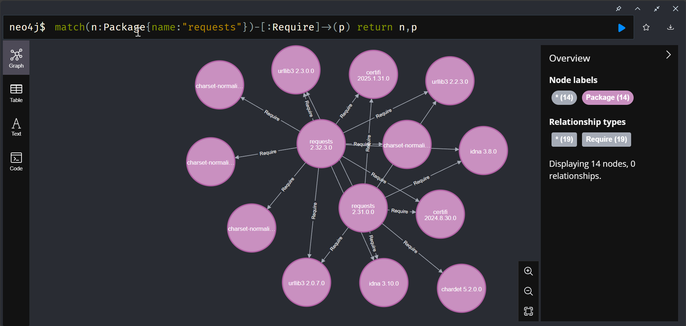

# Wish 工具文档

切换语言: [English](./README_en.md)

---

## 目录
+ [快速开始](#快速开始)
+ [基本用法](#基本用法)
+ [命令介绍](#命令介绍)
+ [界面介绍](#界面介绍)
+ [依赖说明](#依赖说明)
+ [环境变量](#环境变量)
+ [常见问题](#常见问题)
+ [贡献指南](#贡献指南)

---

## 快速开始

下载已发布对应平台的文件压缩资产包，解压并将其拷贝到任意目录即可。执行目录内的 launcher 或 wish 脚本即可（用户可以通过配置和修改启动脚本的环境变量来指向不同的缓存目录和开发目录位置）。
我们可以通过简洁的执行命令请求包我们可以快速同步现有框架上软件， 插件， 工具， 脚本，python模块等等一切都可以打包形式发布上的数据到本地的设备上并且可以直接执行启动软件或者构建脚本。

### 它可以做什么
- 快速打开软件或者工具而无需用户自行下载
- 快速构建环境如python的版本模块和第三方库的快速缓存并执行脚本
- 快速切换项目环境，在多项目环境上通常不同项目使用不同的环境和配置
- 自动管理依賴和开发环境，通过API可以解析包的上下游关系，以及开发模式启用便与开发者了解并使用

## 基本用法
   打开cmd或者对应tty1输入命令wish xxx - yyy (xxx为包字段，yyy为执行字段)
   - 缓存启动blender示例,演示命令第一次请求缓存执行和第二次直接调用已缓存的数据快速启动的过程,
      
   - 命令启动启动器示例,演示启动器界面打开登录获取项目信息已经项目配置的启动器图标版本，双击图标即可直接调用相应命令启动工具
   
   - 命令启动演示切换不同的python版本调用不同的库示例, 在正常用户需要下载安装不同的python版本使用pip或者env等环境下载对应的库，如果一个库支持多个版本的依然会被拷贝多份到各自python版本环境目录
    
   - 快速启动大模型的代理环境和其MCP的服务示例，演示从wish启用大模型的命令行对话方式
   
   - 启动器快速启动maya等软件以及自动许可示例，(仅供学习测试)，同理，我们可以在不同项目内启动不同的软件环境，加载对应项目的插件工具流程等。通过此工具我们可以让在同一个项目内的用户都能获得一个统一的工作环境。而无论用户在哪里。服务端更新后都能及时拉去对应的更新工作环境。
   
   - 启动器快速启动maya并加载arnold渲染器示例，示例相对于传统的部署流程要简约很多，并且可直接启动帮助用户进入工作或者集群渲染，插件可定义适用平台，仅需要通过包名称(mtoa)即可自动适配用于maya2025的插件版本。
   
   总而言之，在wish下，一切皆是缓存，根据指定的目标缓存环境数据，隔离运行环境，减少和规避了用户环境的问题，同时缓存和运行的一致性加强的快速结构及自动化的效率和能力。比如集群计算机。切换环境无需提前部署环境。而工具不同项目的自动初始化不同的环境运行，缓存有记录访问信息，可定制不同的自动化清理策略。
### 命令格式

wish <包名>(必填)[@路径(可选)]=标签(可选) - 命令(可选)
- `包名` 可以指定多个请求包(必须项)
- `命令` 请求包后需要执行的启动命令
- `@` 路径：指定包所在的本地路径(调试可用)；
- `=` 标签：指定包版本选择区间规则；
- `-` 命令：指定需要执行的命令；
#### 示例用法
- `wish python=3.7 requests - python ` 

  请求python为3.7版本 requests为匹配python3.7的最新版本 然后启动python解释器
- `wish python=3.10 requests>=2.32 - python `

  请求python为3.10版本 requests为匹配python3.10版本并大于等与2.32的最新版本 然后启动python解释器
- `wish wish + start(window命令)`

  更新wish自身并详细显示自身依賴并进入到cmd终端, window调试模式输出如下:
   ```
   Setup Path: E:\WishTools\packages\idna\3.10.0\package.py
   Setup Path: E:\WishTools\packages\charset-normalizer\3.4.1.win.0\package.py
   Setup Path: E:\WishTools\packages\requests\2.32.3.0\package.py
   Setup Path: E:\WishTools\packages\typing-extensions\4.12.2.0\package.py
   Setup Path: E:\WishTools\packages\pycryptodome\3.22.0.win.0\package.py
   Setup Path: E:\WishTools\packages\pycparser\2.22.0\package.py
   Setup Path: E:\WishTools\packages\cffi\1.17.1.win.0\package.py
   Setup Path: E:\WishTools\packages\argon2-cffi-bindings\21.2.0.win.0\package.py
   Setup Path: E:\WishTools\packages\argon2-cffi\23.1.0.0\package.py
   Setup Path: E:\WishTools\packages\urllib3\2.3.0.0\package.py
   Setup Path: E:\WishTools\packages\certifi\2025.1.31.0\package.py
   Setup Path: E:\WishTools\packages\minio\7.2.15.0\package.py
   Setup Path: E:\WishTools\packages\7zip\22.0.1.2.win.0\package.py
   Setup Path: E:\WishTools\packages\wish\0.3.11\package.py
   Total Time:  1.85s
   ```
#### 路径指定语法
- `@` 在调试模式下可指定缓存目录外的包(可省略)
#### 标签匹配语法
- `=` 精确匹配最新次版本（默认） wish package_name=1.3 表示匹配 1.3.x 最新
- `<` 小于某个版本 wish package_name<1.3  表示匹配包标签小与1.3版本
- `>` 大于某个版本 wish package_name>1.3  表示匹配包标签小与1.3版本
- `<=` 小与等于某个版本 wish package_name<=1.3  表示匹配包标签小与或等与1.3版本
- `>=` 小与等于某个版本 wish package_name>=1.3  表示匹配包标签大与或等与1.3版本
- `==` 强制等于某个版本 wish package_name==1.3  表示匹配包标签必须为1.3版本，精确版本
- `!=` 不等于某个版本 wish package_name!=1.3  表示匹配包标签必须不为1.3版本，排除版本

#### 命令执行语法
- `-` 简略信息模式，仅显示需要缓存的信息
- `+` 扩展信息模式  使用+替换-执行输出详细执行信息(verbose 模式)

## 命令介绍
Wish 是一款高效简洁的命令式依赖缓存执行器，能够自动缓存所需包及其依赖，并立即执行指定命令，帮助你快速进入开发或运行环境。

### 核心原理与工作流程
Wish 通过命令式包请求与依赖管理，实现自动化环境配置和任务执行。主要流程如下：

1. **包查找与缓存**：
   - 用户通过 wish 命令请求包，Wish 会根据包名、标签、路径等规则在本地缓存和 API 数据库中查找。
   - 本地缓存与云端不一致时自动更新，否则直接使用本地缓存。
   - 支持 @path 指定本地包路径，便于调试和本地开发。
2. **包结构与识别**：
   - 任何包含 package.py 的目录都视为一个包。
   - 当前目录为包版本（tags），上级目录为包名。
   - 匹配到包后自动执行其 package.py 文件。
3. **依赖解析与倒序执行**：
   - Wish 解析包的依赖（req）、平台适用性（ava）、可选扩展（ext）、排除规则（ban）等。
   - 依赖包的 package.py 会倒序执行，确保依赖优先配置。
4. **环境变量与命令执行**：
   - package.py 支持简化环境变量配置（如 env("PATH").insert(...)）。
   - Wish 支持通过 - 或 + 指定命令，自动进入包环境并执行（+ 表示详细输出），也可通过 alias 配置别名。
   - 支持嵌套执行，如 wish python=3.10 - wish python=2.7 - python。
5. **自动化与一体化**：
   - Wish 集成包管理、环境配置、依赖解析、命令执行，大幅提升自动化效率。

### package.py 机制与示例
Wish 通过 package.py 文件实现包的自定义配置、依赖声明和环境变量管理。每个包目录下的 package.py 会在包被请求时自动执行。

#### 1. package.py 的作用
- 声明包的适用平台、依赖、排除规则等
- 配置环境变量，如 PATH、LD_LIBRARY_PATH 等
- 可执行任意 Python 代码，实现灵活初始化逻辑

#### 2. 常用函数说明
- `this`：包信息方法
   - `this.root` 当前包目录路径
   - `this.name` 当前包名称
   - `this.tags` 当前包标签
   - `this.init` 当前包初始化状态（首次执行为 True）
- `env`：环境变量管理方法
   - `env("PATH").setenv(path)` 设置环境变量（覆盖）
   - `env("PATH").insert(path)` 路径插入最前
   - `env("PATH").append(path)` 路径插入最后
   - `env("PATH").remove(path)` 移除指定路径
   - `env("PATH").unload(path)` 按前缀移除路径
   - `env("PATH").envlist()` 获取 PATH 列表
   - `env("PATH").getenv()` 获取 PATH 字符串
   - `env("PATH").unset()` 移除 PATH 变量
- `ava("platform=win32")`：声明平台
- `req("python>=3.10")`：声明依赖
- `ext("pyside2=5.15.2")`：声明扩展
- `ban("numpy==1.24.0")`：排除包
- `alias("test", "python xxxx.py")`：定义别名

#### 3. package.py 示例
```python
import os
ava("platform=win32")
req("python>=3.10")
# ban("numpy==1.24.0")
cmd_path = os.path.join(this.root, "src", "cmd")
env("PATH").insert(cmd_path)
```

#### 4. 执行流程说明
- Wish 解析命令后自动查找并缓存包
- 依赖包的 package.py 倒序执行，最后执行主包
- 通过 wish - 或 wish + 指定命令，自动进入包环境并执行

#### 5. 进阶用法
- 多包依赖与嵌套执行：`wish python=3.10 - wish toolset=latest - python`
- 本地开发包：`wish mypkg@D:/dev/mypkg - mycmd`

### 启动脚本介绍
Wish 启动器（Launcher）本质上是通过 wish 命令启动的图形界面工具，典型命令为：`wish launcher - launcher`
- Launcher 依赖 PySide2（用于界面显示），可通过服务端自动更新
- Windows 下可通过 wish.cmd 启动
- Linux 下可通过 wish 脚本启动
- 启动器本身不是独立可执行文件，而是 wish 的模块扩展
- 用户可将 launcher 脚本打包为可执行文件（如 exe）
- 可通过修改环境变量配置启动脚本

## 界面介绍
wish的默认启动器界面具有简单的用户管理， 项目管理， 启动器配置管理，以及内置的wish运行环境。用户可根据自身的需求接入内部的项目和人员进行管理配置.

基本布局如下所示，1为用户信息选项，2 为布局切换选项，3为语言切换选项，4，为系统操作选项(重启，升级等)，5为环境切换，可切换本地/测试环境

整体界面分为几个模块， 1，启动器模块(launchers), 项目任务模块(project/task) 调试输入模块(imputs)以及输出信息模块(outputs), 除了这些中上和中下分别提供了启动器搜索和启动器简略信息显示功能

实际上wish框架用户可以配置自己的启动器或接入自己的内部的工作流程，默认的启动器仅仅提供演示和参考

### 用户管理
用户管理包含创建用户删除用户分配用户角色权限等，当管理员用户登录后可进入用户系统进行管理操作

### 项目管理
项目管理包含添加删除项目 添加删除任务，添加用户到特定项目，分配特定任务到指定用户，管理员可以管理所有项目，经理能够创建项目和管理自己的项目


### 任务分配
管理员和经理可对项目和任务进行人员分配，经理只能分配关于自己的项目的人员，用户需要先加入项目后然后可以作为项目人员进行任务分配，被分配项目和任务的用户在登录后即可看到自己的项目和需要自己制作的任务信息


### 启动器管理
在特定的项目和任务下创建，更新，删除启动器以及启用和禁用启动器。
启动器正常来说是向下继承的关系， 任务继承了项目启动器，子任务继承父任务启动器，但是子任务可通过禁用来忽略来自父任务的启动器配置。


## 环境变量
Wish 提供了多平台的初始化引导脚本，帮助用户自动配置环境变量并启动 wish 工具：

- Linux： [wish](./platforms/linux/wish), [launcher](./platforms/linux/launcher)
- Windows： [wish](./platforms/windows/wish.cmd), [launcher](./platforms/windows/launcher.ps1)


这些脚本会自动设置 wish 运行所需的环境变量，并调用 wish 主程序, 用户可根据自身需求修改脚本或打包为二进制文件。

以下是 wish 及其依赖包、启动器等所需的主要环境变量：

- **WISH_LOCAL**  Wish 包的根目录位置，默认为资源包所在的文件夹目录。
- **WISH_PYTHON**  指定使用的 Python 版本，不建议定义，默认使用资源包提供的最新 Python 版本。
- **WISH_VERSION**  指定使用的 Wish 版本，不建议定义，默认使用资源包提供的最新 Wish 版本。
- **WISH_PACKAGE_PATH**  指定 Wish 包的存储路径，默认为资源包的 `packages` 目录。
- **WISH_STORAGE_PATH**  指定缓存目录位置，默认值为包根目录下 caches 目录。
- **WISH_DEVELOP_PATH**  指定开发路径，默认值为包根目录下 develops 目录。
- **WISH_PACKAGE_ROOT**  指定 Python 包的根目录，默认值为 包根目录下的 packages/python/<最新版本>。
- **LD_LIBRARY_PATH**  动态库路径，默认包含 `packages/python/<最新版本>/src/lib`（unix平台使用）。
- **PATH**  可执行文件路径，默认包含 `packages/python/<最新版本>/src/bin`。
- **WISH_RESTAPI_URL**  指定RESTAPI的访问地址。
- **WISH_STORAGE_URL**  指定存储服务的访问地址。
- **WISH_PKGSYNC_MODE**  缓存同步模式：0=使用缓存目录（默认），1=禁用缓存目录，2=使用开发目录。

如需自定义环境变量，可直接修改初始化脚本或在系统环境变量中设置。

## 依赖说明

Wish核心依賴组件如下（已随 Releases 资产一同打包）：

- **wish**：提供包解析功能
- **7zip**：用于压缩和解压缩
- **minio**：提供对象存储支持
- **requests**：提供HTTP请求支持

相关依赖已打包在 packages 资产中，请根据自身平台下载对应的初始化包，无需单独安装。通过图数据库的语法我们可以查询谁依賴我，以及我依賴谁的上下游关系(整图依賴)

requests包依賴查询示例如下：
 

核心本地依賴组件是初始化客户端所必须的组件，服务端同样也会更新这些组件客户端会根据自身需求调用。

## 常见问题

Q: 可以不写 @路径 吗？
A: 可以。如果不写，Wish 会使用默认的缓存路径或远程源。

Q: - 执行命令必须要写吗？
A: - 命令可省略，如果省略则仅用于缓存数据包环境。

Q: 如何开启 verbose 模式？
A: 适用 + 替代 - 即可，如：wish requests + 

Q: 启动器无法运行或提示权限不足？
A: 请检查初始脚本的文件权限，Windows 下可尝试右键“以管理员身份运行”，Linux 下确保有执行权限（chmod +x）。

Q: 环境变量未生效？
A: 建议在启动脚本中直接设置，或在系统环境变量中配置。部分变量需重启终端或系统后生效。

Q: 如何切换 Wish 的缓存、包目录等？
A: 可通过设置 `WISH_LOCAL`、`WISH_STORAGE_PATH`、`WISH_PACKAGE_PATH` 等环境变量，或直接修改启动脚本。

Q: 启动 Wish 后命令找不到？
A: 请确认 PATH 环境变量已包含 wish 相关目录，或在 wish 命令前加上完整路径。

Q: 如何在自动化脚本中集成 Wish？
A: 推荐使用 `wish.cmd` 或 `launcher.ps1`，可传递参数和环境变量，适合批量任务和 CI 场景。

Q: 如果遇到包依赖冲突怎么办？
A: Wish 会优先采用命令中指定的包及版本。如果依赖冲突，建议手动指定明确的版本区间，或通过 ban() 在 package.py 中排除冲突包。

Q: 如何清理本地缓存？
A: 直接删除 caches 目录即可，Wish 会在下次请求时自动重新拉取和缓存所需包。

Q: package.py 调试有什么建议？
A: 可以在 package.py 中插入 print 语句输出调试信息，或用 wish + 详细模式查看包脚本路径和执行过程。

Q: 如何自定义 wish 的行为？
A: 可通过环境变量（如 WISH_LOCAL、WISH_STORAGE_PATH 等）自定义缓存、开发、包存储等路径，也可修改 package.py 实现更复杂的初始化逻辑。

Q: Windows 下如何执行 wish？
A: 推荐使用 windows/wish.cmd 或 windows/launcher.ps1 启动，支持命令行参数和环境变量配置。

Q: Linux 下如何执行 wish？
A: 推荐使用 linux/wish 或 linux/launcher 脚本，确保有执行权限（chmod +x）。

Q: 如何排查包未生效或依赖未被正确加载？
A: 检查命令格式、package.py 依赖声明、环境变量设置，并用 wish + 查看详细执行日志。

Q: 支持哪些 Python 版本？
A: 默认支持资源包内置的 Python 版本，也可通过 WISH_PYTHON 指定其他版本（不建议）。

Q: 后端如何部署，采用什么技术栈？
A: 目前后端采用了Gitlab以及它的runner服务进行打包CICD流程，打包数据到minio对象存储，更新关系到neo4j图的数据库上，所以我们可以根据图数据查询上下游包，可以支持上游包预发布的通知下游包自动化测试和修改。

Q: 如何贡献自己的包？
A: 按照包结构规范（含 package.py），提交到指定的包仓库或本地开发目录，并通过 wish @path 方式调试。

## 贡献指南
Fork 本项目；

创建 feature 分支；

提交 PR 并附上说明；

遵循简洁一致的文档格式；
