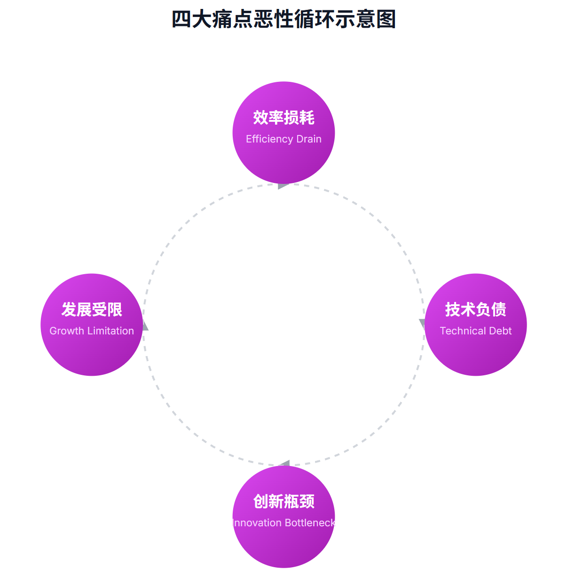
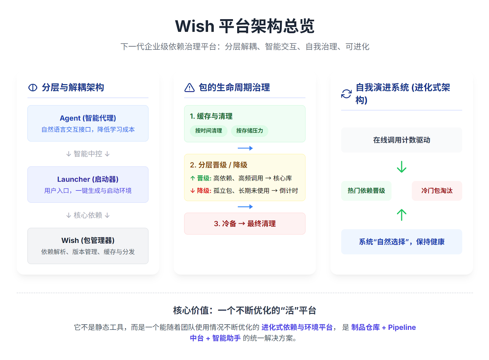
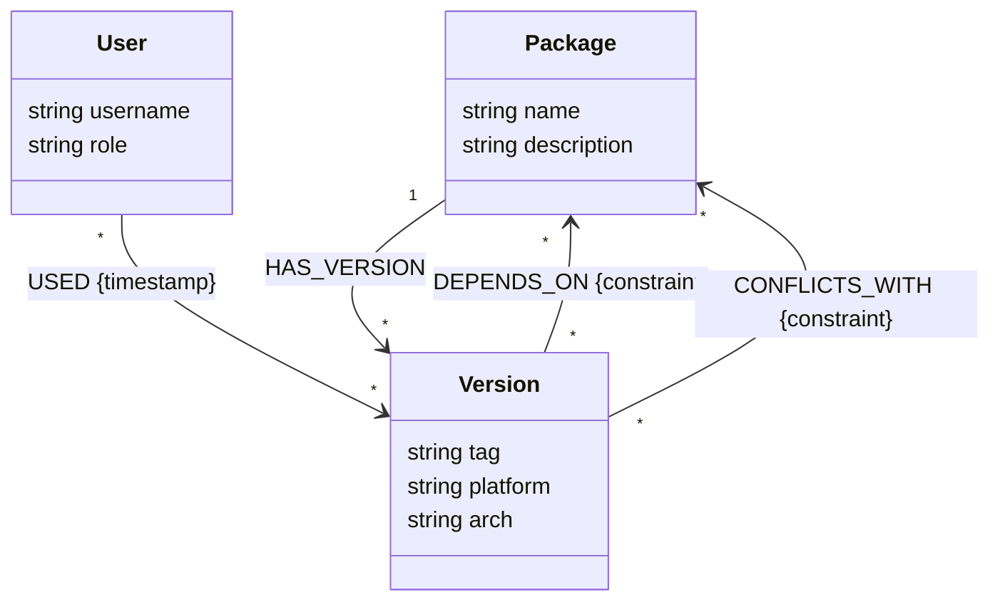

# Wish 平台架构白皮书

> 数字化制作生态的统一基石

## 1. 执行摘要

本文旨在全面阐述 Wish 平台，一个面向未来的企业级、跨平台的软件工具链与生产环境统一管理解决方案。其应用领域覆盖了 3A 游戏开发、影视特效与动画、工业设计（CAD/CAE）、半导体设计（EDA）等所有依赖复杂、定制化软件生态的行业。

Wish 平台扮演了"城市规划师"的角色，通过引入"可进化架构"的核心理念，为整个数字生产基石引入了统一的蓝图、智能的交通规则和健康的新陈代谢机制。

## 2. 挑战与机遇：为何需要 Wish 平台

### 2.1 普遍存在的四大核心痛点

1.  **效率损耗 (Efficiency Drain)**: 新人上手时间长，环境配置反复耗时。
2.  **技术负债 (Technical Debt)**: "僵尸资产"累积，维护成本日益增加。
3.  **创新瓶颈 (Innovation Bottleneck)**: 技术专家沦为"救火队员"，无暇创新。
4.  **发展受限 (Growth Limitation)**: 现有架构无法支撑跨地域协同和业务扩张。

### 2.2 "可进化架构"的破局之道

Wish 平台不再将生产环境视为静态集合，而是将其看作一个动态的生态系统：

*   **全局视野（城市蓝图）**：通过**图数据库**提供全局依赖拓扑图。
*   **自动化交通规则（智能交通系统）**：通过**自动化下游影响验证**，拦截可能引发崩溃的变更。
*   **新陈代谢机制（城市更新系统）**：通过**数据驱动的自我治理**，自动清理僵尸资产。

## 3. 核心价值主张

| 价值维度 | 解决的痛点 | Wish 解决方案 |
| :--- | :--- | :--- |
| **降本增效** | 环境配置耗时、支持成本高 | 一键式环境部署、智能 Agent 交互 |
| **风险控制** | 依赖地狱、更新风险不可知 | 自动化下游影响验证、自我治理 |
| **创新加速** | 技术壁垒高、迭代缓慢 | 赋能非技术人员、标准化发布流程 |
| **战略发展** | 架构僵化、无法支撑增长 | 可进化的数据驱动架构 |

## 4. 解决方案深度解析

### 4.1 自动化下游影响验证

当核心包更新时，Wish 自动查询图数据库，识别受影响的下游项目并触发并行测试。只有所有下游测试通过，新版本才允许发布。



### 4.2 数据驱动的自我治理

平台基于依赖层级和遥测数据执行自动化治理：
*   **晋级 (Promotion)**: 高频使用、高内聚的包自动晋升。
*   **归档 (Demotion)**: 长期闲置的包自动归档。

### 4.3 在线/离线双模运行

*   **离线优先**: 核心功能依赖本地缓存，断网不影响生产。
*   **在线同步**: 网络可用时后台静默更新。

### 4.4 智能 Agent 交互

基于 RAG 的智能助手，允许用户通过自然语言（如"启动项目 A 的 Maya 环境"）操作管线，降低技术门槛。

### 4.5 确定性的数学原理

Wish 将依赖解析转化为 **SAT (Boolean Satisfiability)** 问题，保证了解的**完备性**和**最优性**，消除了"玄学"的不确定性。

### 4.6 遥测中心 (Telemetry Hub)

Wish 客户端会匿名收集使用数据（如启动频率、解析时长、错误日志）并发送至 Telemetry Hub。这些数据不仅用于上述的"自我治理"，还用于：
*   **性能热图**: 识别哪些地区的下载速度最慢。
*   **版本分布**: 决定何时停止支持某个旧版本的软件。
*   **错误聚类**: 快速发现大规模爆发的依赖冲突问题。

## 5. 技术架构

Wish 位于操作系统之上，应用软件之下，是生产环境的**基石层**。



### 5.1 核心组件

*   **Wish Engine**: CLI 和核心驱动，负责依赖解析（SAT 求解器）。
*   **Graph Database**: 存储依赖关系图谱。
*   **Launcher**: 用户图形界面。
*   **Agent**: 智能交互层。
*   **Telemetry Hub**: 数据遥测中心。

### 5.2 联邦式存储与数据模型

Wish 采用"元数据中心化，内容联邦化"的设计。

*   **元数据 (Graph Database)**: 统一存储在图数据库 (Neo4j) 中。
    *   **节点 (Node)**: 代表包 (Package)、版本 (Version)、平台 (Platform) 等实体。
    *   **关系 (Relationship)**: 代表依赖 (DEPENDS_ON)、冲突 (CONFLICTS_WITH)、提供 (PROVIDES) 等逻辑关系。
*   **制品 (Artifacts)**: 可分布在不同的私有 S3 存储桶中，支持跨团队协作与权限隔离。每个团队可以拥有自己的 Bucket，仅需共享元数据即可实现生态互通。

#### 图数据库模型 (Graph Schema)



### 5.3 跨平台依赖解析架构

通过 `package.py` 定义依赖契约：

1.  **`req` (Require)**: 必需依赖 (AND)
2.  **`ava` (Available)**: 可用性条件 (OR)
3.  **`ban` (Ban)**: 冲突禁止 (NOT)
4.  **`xor` (Exclusive OR)**: 互斥选择
5.  **`alt` (Alternative)**: 替代方案
6.  **`ext` (Extension)**: 动态扩展

## 6. 安全架构 (Security Architecture)

Wish 遵循零信任 (Zero Trust) 安全原则：

*   **API 认证**: 所有客户端请求必须携带 HMAC-SHA256 签名的 Token。
*   **制品完整性**: 客户端在下载后自动校验 SHA-256 哈希值，防止中间人篡改。
*   **最小权限**: 客户端进程以普通用户权限运行，严禁请求 Root/Admin 权限。

## 7. 自举 (Self-Hosting)

Wish 引擎本身也是生态中的一个包。这意味着你可以用 Wish 来管理和运行 Wish 自身：

```bash
wish wish=1.0.0-beta - wish ...
```

这种机制确保了平台自身的平滑演进和向后兼容性测试。

## 8. 术语表 (Glossary)

| 术语 | 英文 | 解释 |
| :--- | :--- | :--- |
| **制品** | Artifact | 软件包的二进制文件或压缩包，通常存储在 S3 中。 |
| **元数据** | Metadata | 描述包属性（依赖、版本、平台）的数据，存储在图数据库中。 |
| **求解器** | Solver | 基于 SAT 算法的依赖解析核心组件。 |
| **联邦存储** | Federated Storage | 元数据集中管理，制品分散存储的架构模式。 |
| **自举** | Self-Hosting | 使用工具的旧版本来构建或运行其新版本的能力。 |
| **下游影响** | Downstream Impact | 一个基础库的变更对其所有依赖者造成的潜在风险。 |
