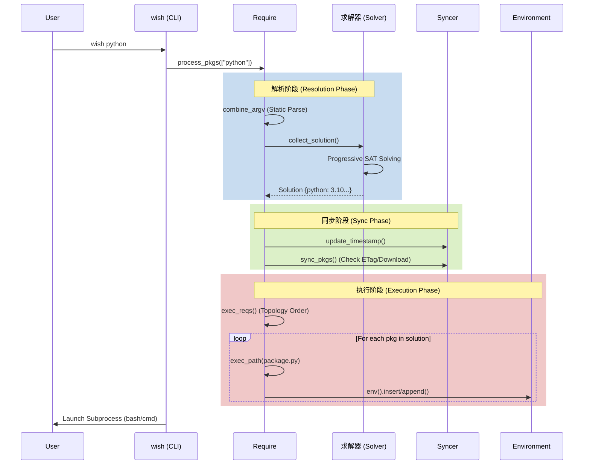

# 架构设计文档

本文档深入解析 Wish Platform 的内部架构、设计理念和关键算法。

## 1. 设计理念

Wish Platform 的设计不仅是为了解决依赖管理，更是为了构建一个**制品 (Artifact)血缘追踪系统 (制品 (Artifact) Lineage System)**。其核心设计原则包括：

*   **一切皆包 (Everything is a Package)**: 工具、库、配置、甚至 Wish 自身都是统一管理的节点。
*   **声明与执行分离 (Separation of Declaration and Execution)**: 静态 AST 解析用于构建依赖图，动态 Python 运行时用于构建环境。
*   **确定性解析 (Deterministic Resolution)**: 使用 SAT 求解器 (Solver)替代传统的贪心算法，确保全局最优解。
*   **环境非侵入 (Non-Intrusive)**: 仅修改内存中的环境变量，绝不污染宿主机系统文件。

## 2. 系统分层架构

Wish 采用典型的分层架构设计，各层职责清晰，通过标准接口通信。

```
+---------------------------------------------------------------+
|                  用户交互层 (User Interface Layer)            |
|  [ CLI (wish) ]      [ Launcher (GUI) ]      [ Agent (LLM) ]  |
+-------------------------------+-------------------------------+
                                |
                                v
+---------------------------------------------------------------+
|                   核心逻辑层 (Core Logic Layer)               |
|                                                               |
|   [ 依赖解析器 Resolver ] <-----> [ 执行引擎 Executor ]       |
|         | (SAT 求解器 (Solver))                  | (Python Runtime)    |
|         v                               v                     |
|   [ 静态分析器 Parser ]           [ 环境管理器 Context ]      |
|     (AST Extraction)                (Environ / Thispath)      |
+-------------------------------+-------------------------------+
                                |
                                v
+---------------------------------------------------------------+
|                   数据访问层 (Data Access Layer)              |
|                                                               |
|   [ 同步器 Syncer ] <---------> [ 缓存管理 Cache Manager ]    |
|      (HTTP/S3)                      (SQLite / FS)             |
|                                                               |
|   [ 并发控制 Locker ]                                         |
+-------------------------------+-------------------------------+
                                |
                                v
+---------------------------------------------------------------+
|                   基础设施层 (Infrastructure Layer)           |
|                                                               |
|   [ 图数据库 Graph DB ] <-----> [ 元数据 API Metadata ]       |
|         (Relationships)                 (REST)                |
|                                                               |
|   [ 制品 (Artifact)存储 制品 (Artifact) Store ]                                 |
|         (S3 / MinIO)                                          |
+---------------------------------------------------------------+
```

### 2.1 各层职责详解

*   **用户交互层**: 负责接收用户指令。CLI 是最基础的入口，Launcher 提供图形化操作，Agent 接口支持自然语言交互。
*   **核心逻辑层 (Kernel)**: 系统的"大脑"。
    *   **Resolver**: 负责将依赖关系转化为 SAT 问题并求解。
    *   **Executor**: 负责运行 `package.py` 中的动态逻辑。
    *   **Parser**: 使用 AST 提取静态依赖元数据。
*   **数据访问层**: 负责数据的获取与持久化。
    *   **Syncer**: 智能同步组件，负责从远程拉取元数据和文件，支持断点续传和 ETag 校验。
    *   **Cache**: 本地 SQLite 数据库加速查询，文件系统缓存 制品 (Artifact) (制品 (Artifact) (制品 (Artifact) (制品 (Artifacts))))。
*   **基础设施层**: 服务端组件。
    *   **Graph DB**: 存储复杂的包依赖与血缘关系。
    *   **制品 (Artifact) Store**: 存储实际的二进制包文件。

## 3. 核心引擎：双模解析机制

Wish 的强大之处在于其独特的**双模解析机制**。

### 3.1 静态解析引擎 (AST Engine)
*   **输入**: `package.py` 源码。
*   **工具**: Python `ast` 模块。
*   **目的**: 提取依赖拓扑图 (Dependency Graph)。
*   **特点**: **不执行代码**，只分析语法树。因此忽略所有 `if` 条件。
*   **产出**: `req`, `ava`, `ban`, `xor` 等元数据，直接存入 Graph DB。

### 3.2 动态执行引擎 (Runtime Engine)
*   **输入**: `package.py` 编译后的 Code Object。
*   **工具**: Python `exec()`。
*   **目的**: 构建运行时环境 (Environment Construction)。
*   **特点**: **完整执行代码**，拥有文件系统读写权限和环境变量修改权限。
*   **产出**: 最终的进程环境变量 (`PATH`, `PYTHONPATH` 等)。

## 4. 运行时生命周期 (Runtime Lifecycle)

当用户执行 `wish python` 时，系统经历以下阶段：



## 5. 关键算法：SAT 求解与权重

### 5.1 SAT 问题建模
Wish 将依赖解析转化为布尔可满足性问题 (SAT)。每个 `(包名, 版本)` 对应一个布尔变量 $V_{pkg,ver}$。
*   **硬约束 (Hard Constraints)**: 必须满足的条件（如版本互斥、依赖关系、冲突关系）。
*   **软约束 (Soft Constraints)**: 优化的目标（如选择最新版本、选择层级最浅的版本）。

### 5.2 权重公式
求解器 (Solver)使用 MaxSAT 算法寻找满足所有硬约束且权重和最大的解：

$$ Weight = (100 - Pos) \times 10000 + (100 - Level) \times 100 + Rank $$

*   $Pos$: 命令行参数中的顺序索引 (越靠前优先级越高)。
*   $Level$: BFS 依赖层级 (越浅优先级越高)。
*   $Rank$: 版本排序索引 (越新优先级越高)。

此公式确保了系统优先满足用户直接指定的包，其次是直接依赖，并倾向于选择最新版本。

## 6. 数据流向 (Data Flow)

```mermaid
graph TD
    CLI[CLI: wish] --> Require[Require: 递归解析入口]
    Require --> 求解器 (Solver)[求解器 (Solver): 依赖解析与 SAT 求解]
    求解器 (Solver) --> Syncer[Syncer: 远程同步管理]
    Syncer --> API[REST API: 获取元数据/依赖关系]
    Syncer --> S3[S3/MinIO: 下载包文件/制品 (Artifact) (制品 (Artifact) (制品 (Artifact) (制品 (Artifacts))))]
    API --> Cache[Local Cache: SQLite & 文件系统]
    S3 --> Cache
    Cache --> Execution[Execution: 构建环境变量并执行]
```

## 7. 扩展性设计

*   **元数据与负载分离**: REST API 仅传输轻量元数据，S3 传输大文件，支持 CDN 加速。
*   **多源高可用**: `Syncer` 支持配置多个 API 和 S3 端点，自动故障转移。
*   **插件式架构**: 核心逻辑与具体的包实现解耦，包通过 `package.py` DSL 定义行为。

## 8. 深度解析：Syncer 同步机制

### 8.1 最小化传输算法
1.  **解析优先**: Syncer 只有在 SAT 求解器 (Solver)确定了唯一的解集 (Solution) 之后才会介入。
2.  **差异比对**: 它遍历解集中的每一个包版本，检查本地缓存路径 (`WISH_PACKAGE_PATH/pkg/ver`) 是否存在且完整。
3.  **按需下载**: 仅下载本地缺失的包。如果是增量更新（例如同一个版本的元数据变更），会对比 ETag。

### 8.2 高可用轮询 (Client-Side HA)
Syncer 内部维护了一个端点列表 (Endpoint List)。
*   初始列表: `[WISH_RESTAPI_URL, WISH_RESTAPI_URL1, ..., WISH_RESTAPI_URL10]`
*   **Failover**: 当发生网络超时或 5xx 错误时，自动切换到列表中的下一个节点重试。
*   **恢复**: 在新的会话中，优先重置回主节点。

### 8.3 本地缓存数据库 (Cache Schema)

Wish 在客户端使用 SQLite 维护一个轻量级的缓存索引 `manifest.db`，用于记录包的元数据快照和访问时间。

```sql
CREATE TABLE manifest (
    name TEXT,          -- 包名
    version TEXT,       -- 版本号
    etag TEXT,          -- 远程 ETag (用于一致性校验)
    last_access INTEGER -- 最后访问时间戳 (用于 LRU 清理)
);
CREATE INDEX idx_pkg ON manifest (name, version);
```

Syncer 在每次同步前会查询此表：
*   如果 ETag 匹配且文件存在，跳过下载。
*   如果 ETag 不匹配，重新下载并更新记录。
*   `DBManage` 组件会定期扫描 `last_access`，清理长期未使用的包以释放磁盘空间。

### 8.4 并发控制机制 (Locking Mechanism)

为了防止多进程并发下载同一个包导致文件损坏，Wish 实现了一个基于原子文件操作的 `Locker` 类。

*   **锁文件位置**: 每个包版本的锁文件位于其父目录，命名为 `.{version}.lock`。
*   **获取锁**: 使用 `os.open` 配合 `O_CREAT | O_EXCL` 标志。这是操作系统级别的原子操作，保证只有一个进程能成功创建文件。
*   **超时与重试**: 采用指数退避算法 (Exponential Backoff)，初始等待 1s，最大重试 60s。
*   **僵尸锁清理**: 如果持有锁的进程崩溃，后来的进程在检测到锁文件超时（例如超过 5 分钟未更新）后，会强制夺锁。

### 8.5 认证协议 (Authentication Protocol)

客户端与服务端的所有交互均通过 HTTP Header 进行身份验证。

*   **Header**: `X-Wish-Token: <access_key>:<signature>`
*   **Signature**: `HMAC-SHA256(secret_key, timestamp + method + path)`
*   **安全性**: 该机制防止了重放攻击，并确保只有授权的客户端可以访问元数据 API。

## 9. 管理员查询参考 (Administrative Queries)

对于运维人员，直接查询 Neo4j 图数据库是排查依赖问题的终极手段。

### 9.1 查询孤儿包 (Finding Orphan Packages)
查找没有被任何其他包依赖的包（可能是过时的根节点）。

```cypher
MATCH (p:Package)
WHERE NOT (p)<-[:DEPENDS_ON]-(:Version)
RETURN p.name
```

### 9.2 追踪依赖链 (Tracing Dependency Chain)
查找从 `Application` 到 `Library` 的所有依赖路径。

```cypher
MATCH path = (a:Package {name: 'maya'})-[:HAS_VERSION]->(:Version)-[:DEPENDS_ON*]->(:Package {name: 'openssl'})
RETURN path
LIMIT 5
```
