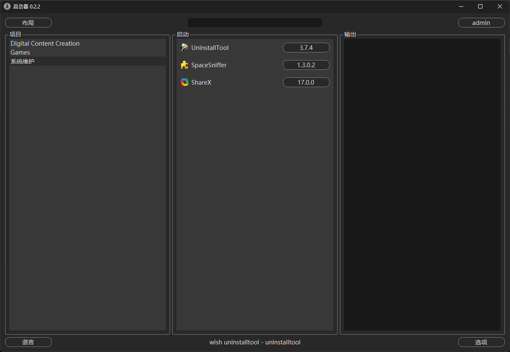
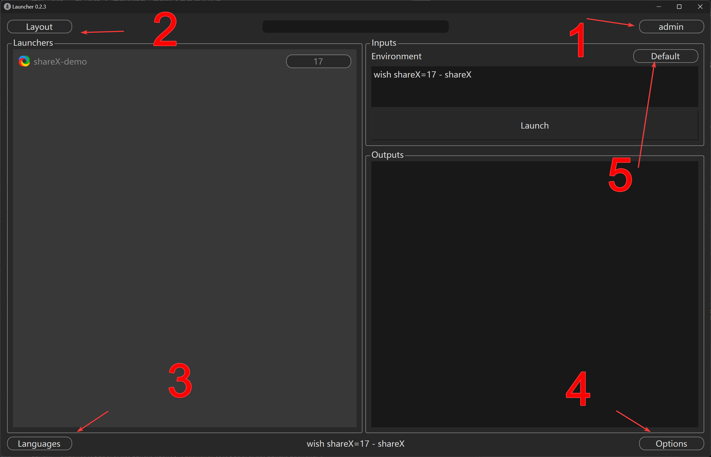
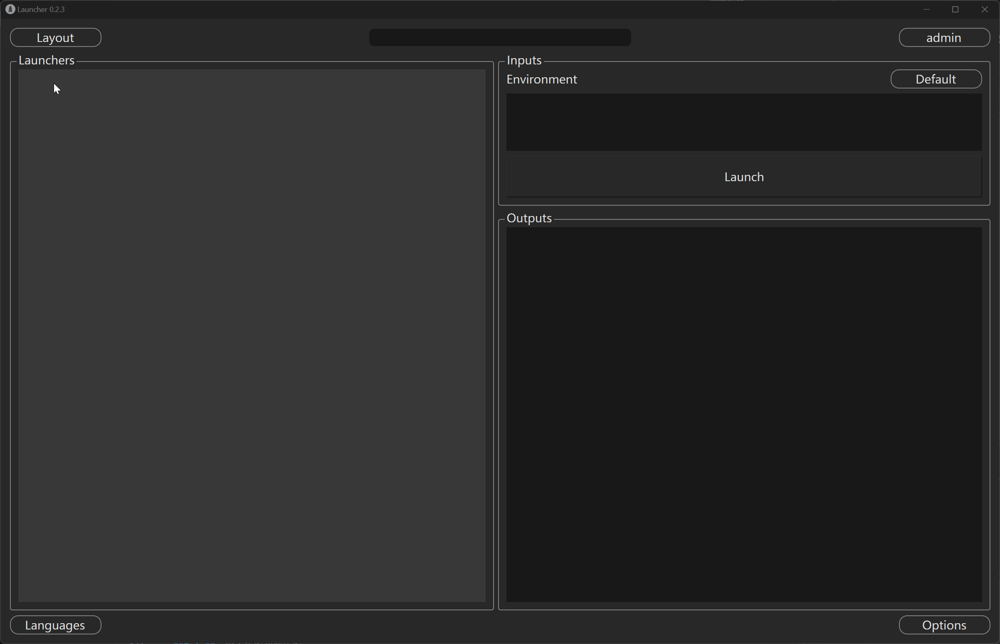

# Launcher 界面指南

Wish Launcher 提供了一个图形用户界面，用于项目管理、环境切换和工具启动。

## 概览

1.  **用户资料 (User Profile)**: 管理账户设置。
2.  **布局切换 (Layout Switcher)**: 切换不同的视图布局。
3.  **语言 (Language)**: 切换中英文界面。
4.  **系统操作 (System Ops)**: 重启、升级。
5.  **环境 (Environment)**: 切换 Local (本地) / Prod (生产) / Test (测试) 环境。

## 功能特性

### 项目管理
管理员和经理可以创建项目和任务，并将用户分配给它们。

### 工具/启动器管理
启动器具有层级继承关系：任务 (Task) 继承自项目 (Project)。

### 快捷键
*   `Ctrl+E`: 打开输入控制台
*   `Ctrl+D`: 删除输入控制台
*   `Ctrl+Enter`: 执行选中的启动器
*   `Ctrl+Up/Down`: 切换启动器版本

## 工作流示例：从零配置新项目

以下是如何在 Launcher 中配置一个新项目的完整流程：

1.  **登录**: 使用管理员账号登录 Launcher。
2.  **创建项目**:
    *   点击左侧边栏的 "+" 号。
    *   输入项目名称 (如 "Project-Titan")。
    *   设置项目的根路径环境变量 (如 `PROJECT_ROOT=/mnt/projects/titan`)。
3.  **分配人员**:
    *   在项目详情页，切换到 "Members" 标签。
    *   搜索用户并添加到项目组。
4.  **配置软件栈 (Software Stack)**:
    *   切换到 "Launchers" 标签。
    *   点击 "Add Tool"。
    *   选择 "Maya"，配置版本为 `2024`。
    *   在 "Environment" 区域，输入 `wish project=titan maya=2024`。
5.  **发布**: 点击 "Publish" 按钮，配置将推送至所有团队成员的 Launcher。

## 常见问题排查 (Troubleshooting)

### Debug 模式
如果遇到 Launcher 启动失败或界面卡死，可以尝试通过命令行启动 Debug 模式以获取更多日志：

*   **Windows**: `platforms\windows\launcher.ps1 -Debug`
*   **Linux**: `bash platforms/linux/launcher --debug`

日志文件通常位于 `~/.wishtools/logs/launcher.log`。
