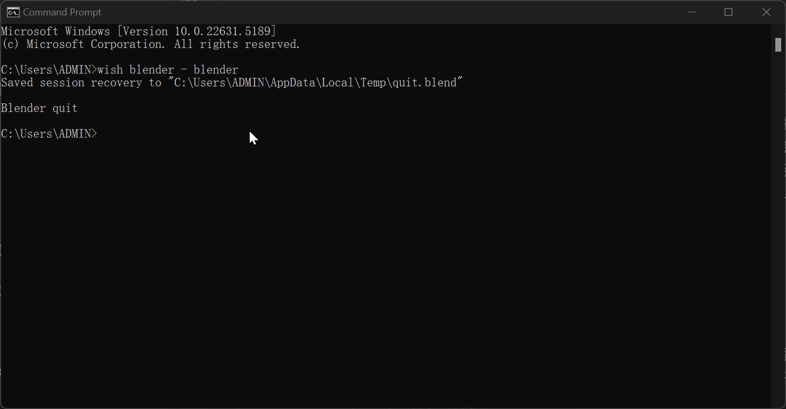
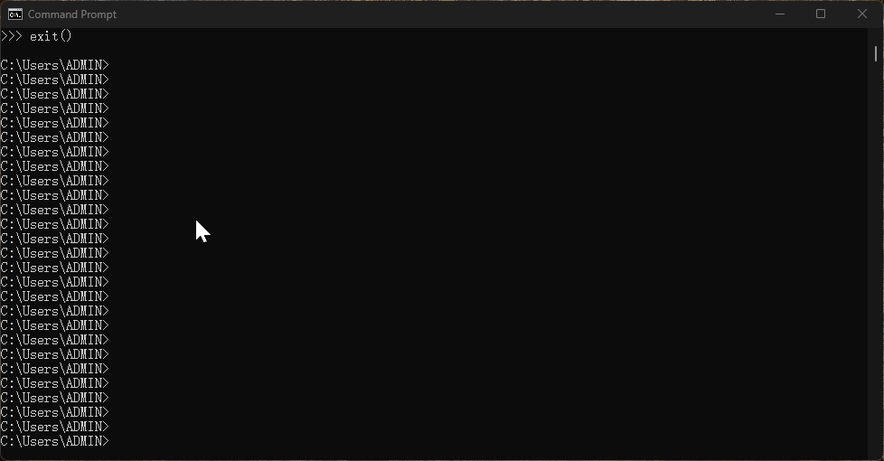

# Wish Tool Documentation

[中文版](./wish-zh.md)

---

## Table of Contents
+ [Quick Start](#quick-start)
+ [Quick Examples](#quick-examples)
+ [Basic Usage](#basic-usage)
+ [Command Guide](#command-guide)
+ [UI Guide](#ui-guide)
+ [Dependency Notes](#dependency-notes)
+ [Environment Variables](#environment-variables)
+ [FAQ](#faq)
+ [Contributing Guide](#contributing-guide)

---

## Quick Start

Download the release package for your platform, extract it to any directory, and run the launcher or wish script in that directory. You can configure or modify environment variables in the startup script to point to different cache or development directories.

With simple commands, you can quickly sync software, plugins, tools, scripts, Python modules, and any data that can be packaged to your local device, and directly launch or build scripts.

---

## Quick Examples

Here are the most common Wish command scenarios:

| Scenario                | Example Command                                 | Description                        |
|-------------------------|-------------------------------------------------|------------------------------------|
| Launch specific Python  | wish python=3.10 - python                       | Specify Python version and launch  |
| Install & run requests  | wish python=3.7 requests - python               | Specify Python 3.7 and load requests|
| Launch Wish Launcher    | wish launcher - launcher                        | Launch GUI launcher                |
| Update Wish itself      | wish wish + start                               | Update Wish and show dependencies  |
| Local dev package debug | wish mypkg@D:/dev/mypkg - mycmd                 | Specify local package path for debug|

---

## Basic Usage
Open cmd or terminal, enter `wish xxx - yyy` (xxx is the package, yyy is the command).

- Example: Cache and launch Blender, showing first-time cache and fast launch from cache:
  
  *First cache vs fast launch demo*
- Example: Launch GUI launcher, login, get project info, and project config with launcher icons:
  
  *Launcher UI and project config demo*
- Example: Switch between different Python versions and libraries, no manual install needed:
  
  *Multi-version Python and library switching*
- Example: Quickly launch LLM proxy and MCP service, show Wish LLM CLI dialog:
  
  *LLM CLI dialog demo*
- Example: Quickly launch Maya and auto-license (for learning/testing), different projects load different environments and plugins:
  
  *Unified work environment and auto-license*
- Example: Launch Maya and load Arnold renderer, auto-adapt plugin version:
  
  *Maya launch and Arnold plugin auto-load*
- Example: Launch Maya with Arnold and GS Toolbox plugins, show plugin config:
  
  *Maya multi-plugin config demo*

In summary, everything in Wish is cached. It isolates runtime environments, reduces user environment issues, and ensures consistency and automation. For example, clusters can switch environments without pre-deployment, tools auto-initialize per project, and cache records can be customized for cleanup.

### Command Format

| Parameter | Description                        | Required |
|-----------|------------------------------------|----------|
| package   | Specify requested package(s)       | Yes      |
| @path     | Specify local package path (debug) | Optional |
| =tag      | Specify version range rule         | Optional |
| -command  | Specify command to execute         | Optional |

Format:

```shell
wish <package>(required)[@path(optional)]=tag(optional) - command(optional)
```

- `package`: can specify multiple packages (required)
- `command`: command to execute after requesting package
- `@path`: specify local package path (debug, optional)
- `=tag`: specify version selection rule (optional)
- `-command`: command to execute (optional)

#### Usage Examples
- `wish python=3.7 requests - python`
  Request Python 3.7, requests matches latest for 3.7, then launch Python
- `wish python=3.10 requests>=2.32 - python`
  Request Python 3.10, requests >=2.32, then launch Python
- `wish wish + start`
  Update Wish and show dependencies, enter cmd terminal

#### Path Syntax
- `@` can specify a package outside the cache dir (debug, optional)
#### Tag Syntax
- `=` match latest minor version (default)
- `<` less than a version
- `>` greater than a version
- `<=` less than or equal to
- `>=` greater than or equal to
- `==` exact version
- `!=` exclude a version
#### Command Execution Syntax
- `-` simple info mode (show only cache info)
- `+` verbose mode (detailed execution info)

## Command Guide
Wish is a highly efficient and concise command-line dependency cache executor. It automatically caches required packages and their dependencies, and immediately executes specified commands to help you quickly enter your development or runtime environment.

### Core Principles & Workflow
Wish enables automated environment configuration and task execution through command-based package requests and dependency management. The main workflow is as follows:

1. **Package Lookup & Caching**:
   - When a user requests a package via the wish command, Wish searches the local cache and API database based on package name, tag, path, etc.
   - If the local cache is inconsistent with the cloud, it will auto-update; otherwise, it uses the local cache directly.
   - Supports @path to specify a local package path for debugging and local development.
2. **Package Structure & Identification**:
   - Any directory containing package.py is considered a package.
   - The current directory is the package version (tags), and the parent directory is the package name.
   - After matching a package, its package.py is executed automatically.
3. **Dependency Parsing & Reverse Execution**:
   - Wish parses dependencies (req), platform compatibility (ava), optional extensions (ext), exclusion rules (ban), etc.
   - Dependency packages' package.py files are executed in reverse order to ensure dependencies are configured first.
4. **Environment Variables & Command Execution**:
   - package.py supports simplified environment variable configuration (e.g., env("PATH").insert(...)).
   - Wish supports specifying commands with - or +, automatically entering the package environment and executing (+ for verbose output), and can configure aliases via alias.
   - Supports nested execution, e.g., wish python=3.10 - wish python=2.7 - python.
5. **Automation & Integration**:
   - Wish integrates package management, environment configuration, dependency parsing, and command execution, greatly improving automation efficiency.

### package.py Mechanism & Example
Wish uses package.py for custom configuration, dependency declaration, and environment variable management. Each package's package.py is executed automatically when the package is requested.

#### 1. Purpose of package.py
- Declare applicable platforms, dependencies, exclusion rules, etc.
- Configure environment variables such as PATH, LD_LIBRARY_PATH, etc.
- Run arbitrary Python code for flexible initialization logic

#### 2. Common Functions
- `this`: package info methods
   - `this.root`: current package directory path
   - `this.name`: current package name
   - `this.tags`: current package tags
   - `this.init`: initialization status (True on first execution)
- `env`: environment variable management
   - `env("PATH").setenv(path)`: set environment variable (overwrite)
   - `env("PATH").insert(path)`: insert path at the front
   - `env("PATH").append(path)`: insert path at the end
   - `env("PATH").remove(path)`: remove specified path
   - `env("PATH").unload(path)`: remove path by prefix
   - `env("PATH").envlist()`: get PATH as a list
   - `env("PATH").getenv()`: get PATH as a string
   - `env("PATH").unset()`: unset PATH variable
- `ava("platform=win32")`: declare platform
- `req("python>=3.10")`: declare dependency
- `ext("pyside2=5.15.2")`: declare extension
- `ban("numpy==1.24.0")`: exclude package
- `alias("test", "python xxxx.py")`: define alias

#### 3.  Example for package.py 
```python
import os
# Declare only for Windows platform
ava("platform=win32", "maya=2025")
# Depend on Python 3.10 and requests
req("python>=3.10")
req("requests>=2.32","httpx")
# Exclude specific numpy version
ban("numpy==1.24.0")
# Configure PATH environment variable
cmd_path = os.path.join(this.root, "src", "bin")
env("PATH").insert(cmd_path)
# Define alias command
alias("run", "python main.py")
# Optional extension dependency
ext("pyside2=5.15.2")
# Initialization logic
if this.init:
    print(f"[{this.name}] Initialization complete, current version: {this.tags}")
```


#### 4. Execution Flow
- Wish parses the command and automatically finds and caches the package
- Dependency packages' package.py files are executed in reverse order, then the main package
- Use wish - or wish + to specify a command, automatically enter the package environment and execute

#### 5. Advanced Usage
- Multiple dependencies and nested execution: `wish python=3.10 - wish toolset=latest - python`
- Local development package: `wish mypkg@D:/dev/mypkg - mycmd`

### Launcher Script Guide
The Wish launcher (Launcher) is essentially a GUI tool started via the wish command, e.g., `wish launcher - launcher`
- Launcher depends on PySide2 (for GUI), and can be auto-updated via the server
- On Windows, use wish.cmd to launch
- On Linux, use the wish script to launch
- The launcher itself is not a standalone executable, but an extension module of wish
- Users can package the launcher script as an executable (e.g., exe)
- You can configure the startup script by modifying environment variables

## Launcher Guide
The default launcher provides user management, project management, launcher config management, and a built-in wish environment. Users can integrate their own workflows; the default launcher is for demo/reference.

### User Management
Create/delete users, assign roles/permissions
### Project Management
Add/delete projects and tasks, assign users to projects/tasks
### Launcher Management
Create/update/delete/enable/disable launchers under projects/tasks; launchers are inherited by default, but can be disabled in sub-tasks

## Environment Variables
Wish provides cross-platform init scripts to auto-configure env vars and launch wish:
- Linux: [wish](./platforms/linux/wish), [launcher](./platforms/linux/launcher)
- Windows: [wish](./platforms/windows/wish.cmd), [launcher](./platforms/windows/launcher.ps1)

These scripts auto-set env vars and call the main program; users can modify or package as needed.

Main env vars:
- **WISH_LOCAL**: root dir
- **WISH_PYTHON**: Python version
- **WISH_VERSION**: Wish version
- **WISH_PACKAGE_PATH**: package storage
- **WISH_STORAGE_PATH**: cache dir
- **WISH_DEVELOP_PATH**: dev dir
- **WISH_PACKAGE_ROOT**: Python package root
- **LD_LIBRARY_PATH**: lib path (Unix)
- **PATH**: bin path
- **WISH_RESTAPI_URL**: REST API
- **WISH_STORAGE_URL**: storage service
- **WISH_PKGSYNC_MODE**: cache sync mode (0=default, 1=disable cache, 2=dev dir)

To customize, edit the init script or set system env vars.

## Dependencies
Wish and the launcher depend on these core components (already packaged):
- **wish**: package parsing
- **7zip**: compression
- **minio**: object storage
- **requests**: HTTP requests
No separate installation needed; download the right package for your platform.

## FAQ

> Tip: Use Ctrl+F to quickly search for keywords.

### Environment & Execution

- **Q: Is @path required?**  
  **A:** No. If omitted, Wish uses the default cache path or remote source.

- **Q: Is the command after '-' required?**  
  **A:** No. You can use Wish just to cache packages and dependencies.

- **Q: Launcher won't run or says permission denied?**  
  **A:** Check script file permissions. On Windows, try "Run as administrator". On Linux, ensure execute permission (`chmod +x`).

- **Q: Environment variables not effective?**  
  **A:** Set them directly in the startup script or in your system environment. Some variables require restarting the terminal or system.

- **Q: Command not found after starting Wish?**  
  **A:** Make sure the PATH environment variable includes the Wish directories, or use the full path for Wish commands.

- **Q: How to run Wish on Windows?**  
  **A:** Use `windows/wish.cmd` or `windows/launcher.ps1`, which support command line arguments and environment variables.

- **Q: How to run Wish on Linux?**  
  **A:** Use `linux/wish` or `linux/launcher`, and ensure execute permission (`chmod +x`).

### Cache & Dependencies

- **Q: How to switch Wish's cache, package directory, etc.?**  
  **A:** Set `WISH_LOCAL`, `WISH_STORAGE_PATH`, `WISH_PACKAGE_PATH`, or modify the startup script directly.

- **Q: How to clear the local cache?**  
  **A:** Delete the `caches` directory. Wish will re-fetch and cache required packages on the next request.

- **Q: What if there are dependency conflicts?**  
  **A:** Wish prioritizes the package and version specified in the command. For conflicts, specify a clear version range or use `ban()` in `package.py` to exclude conflicting packages.

- **Q: Which Python versions are supported?**  
  **A:** By default, the Python version bundled in the resource package is used. You can set `WISH_PYTHON`, but it's not recommended.

- **Q: What if a package or dependency is not loaded correctly?**  
  **A:** Check the command format, `package.py` dependencies, environment variables, and use `wish +` for detailed logs.

### Command & Debugging

- **Q: How to enable verbose mode?**  
  **A:** Use `+` instead of `-`, e.g. `wish requests +`

- **Q: How to integrate Wish in automation scripts?**  
  **A:** Use `wish.cmd` or `launcher.ps1`, which support passing arguments and environment variables, suitable for batch tasks and CI.

- **Q: Any tips for debugging package.py?**  
  **A:** Add print statements in `package.py` or use `wish +` for verbose output and script path info.

- **Q: How to customize Wish behavior?**  
  **A:** Set environment variables (`WISH_LOCAL`, `WISH_STORAGE_PATH`, etc.) or modify `package.py` for advanced logic.

### Server & Contribution

- **Q: How is the backend deployed and what tech stack is used?**  
  **A:** The backend uses Gitlab and its runner service for packaging and CICD, uploads data to MinIO object storage, and updates relationships to a Neo4j graph database. This allows querying upstream/downstream packages and supports automated testing and notification for downstream packages when upstream packages are pre-released.

- **Q: How to contribute your own package?**  
  **A:** Follow the package structure (with `package.py`), submit to the package repo or local develop directory, and debug with `wish @path`.

## Contributing Guide
Fork this project;

Create a feature branch;

Submit a PR with a description;

Follow a concise and consistent documentation style;

